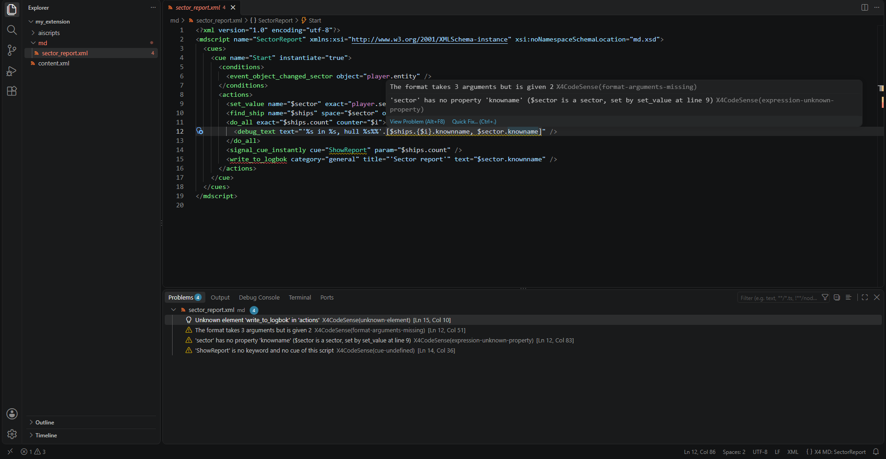
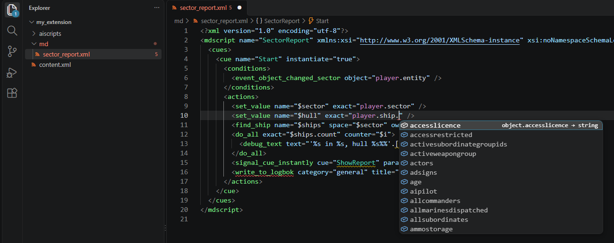
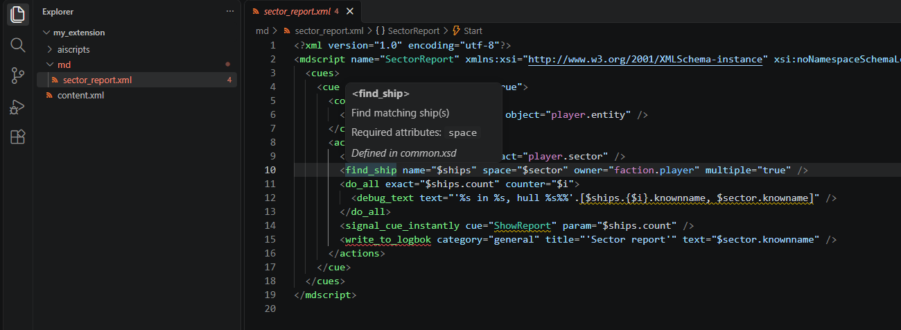
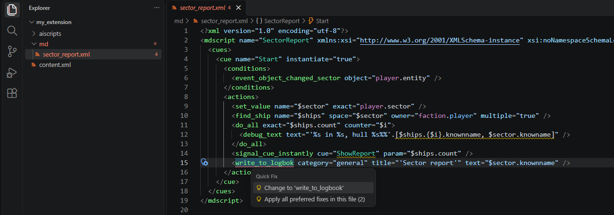
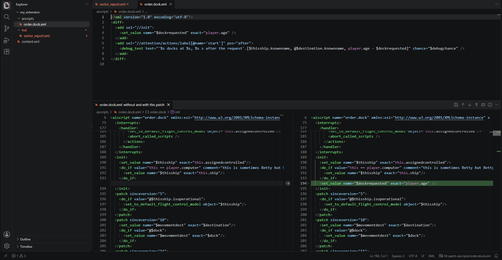
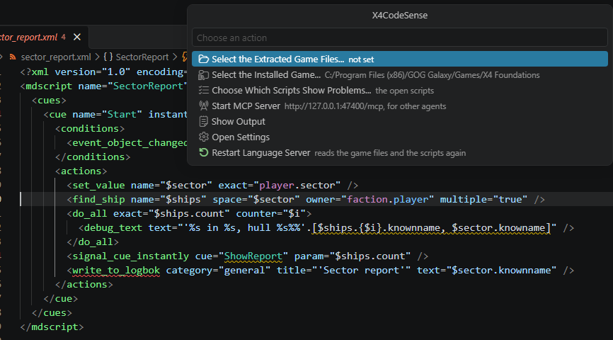

# X4CodeSense

Language support for **X4: Foundations** scripts in Visual Studio Code: AI scripts (`aiscripts/*.xml`), Mission Director scripts (`md/*.xml`) and the patches (`<diff>`) that change them or the game's library files (`libraries/*.xml`). X4CodeSense reads the game's schemas, script properties and texts, and the scripts of the game, its DLCs and your extensions, and checks your scripts as you type.

X4CodeSense is the successor of X4CodeComplete, written anew around a language server, so the same analysis also runs from the command line and in CI. It replaces X4CodeComplete and offers to take its settings.

> From 1.0.0 the settings, the commands, the diagnostic codes, and the checker's options and output formats change only with a new major version: new ones may come in any version.

## ✨ Features

### Checks as you type

- XML well-formedness, as the game's parser sees it: unclosed tags, missing or unquoted attribute values, missing end tags, repeated attributes, attributes without whitespace between them, an `&` that starts no reference or an entity XML does not know (`&nbsp;`), `--` inside a comment, a `<` that starts no tag, text outside the root element, an XML declaration that is not at the very start.
- Validation against the game's XSD schemas: unknown elements and attributes, elements in the wrong place or missing, missing required attributes, invalid attribute values. Text inside an element, which the schemas allow nowhere in scripts, is a warning: a stray `>`, an attribute typed after its tag was closed.
- Expressions, parsed as the game parses them: syntax errors, `@` combined with `?`, text references that are not `{page, id}` literals, `%d` in format strings.
- Formats, `'%s of %s'.[$a, $b]` and `{page, id}.[…]`: fewer arguments than the placeholders take is a warning; arguments no placeholder takes, which are not shown, are reported as information.
- Property chains, checked against `scriptproperties.xml`: a property the type at hand does not have (`player.ship.frobnicate`), a chain that stops inside a property name (`$table.keys` for `keys.list`, with quick fixes to complete it) and, in AI scripts, a chain head that is no keyword. A table's keys are read with `$` or braces (`$table.$name`, `$table.{'name'}`), so a bare name after a table is reported. Also on a variable whose type the script tells, `$ship.frobnicate` after `<set_value name="$ship" exact="player.ship"/>`, also under `@` or tested with `?`, where the game gives null or false. Where the type is only guessed from the action that sets the variable (`<create_ship name="$ship">`), the finding is information of its own code, `expression-unknown-property-guessed`, and says so: "(if $ship is a ship, as guessed from create_ship at line 12)". Its quick fix is offered, never applied on its own.
- Names, checked across the game, its DLCs and your extensions: labels, cues and libraries, interrupt library items, `md.Script.Cue`, and text references that no file defines; names defined twice.
- Variables that are read but never set, following the cue namespace rules of the Mission Director.
- Parameters a call passes that the script, order or library it names does not declare: a `<param name="…">` of `run_script`, `create_order`, `run_actions`, a `cue` with `ref` and the like. Parameters a call leaves out are not reported; the game takes them as null.
- AI script names and order ids a call writes as is (`run_script name="'move.generic'"`, `create_order id="'Attack'"`) that no script of the game, its DLCs, the extensions or your workspace defines.

All of it keeps working while a tag, an attribute or a quote is still being typed. Open files count with their unsaved changes, and files changed, created or deleted on disk in the workspace, also with their folder, are read again or forgotten.

The Problems panel lists the problems of the open scripts, also of those in tabs that VS Code restored at start but has not shown yet, as they are on disk. With `x4CodeSense.diagnosticMode` set to `workspace`, it also lists those of every other script and patch in the workspace folders, as they are on disk. They are checked once the scripts are indexed, and again when something they refer to changes, for example when a cue or an order is renamed in the editor; an open script's problems follow the editor as before.



### Completion and hover

- Child elements allowed at the caret, attribute names, and attribute values from the schemas.
- Property chains in expressions (`player.ship.cargo.{$ware}.count`), keywords, and the values of lookups such as `class` or `ware`. After a variable whose type the script tells, the properties of that type: `$ship.` after `<create_ship name="$ship">` offers a ship's, and hover and go to definition of `$ship.name` name the ship's property rather than every datatype's `name`.
- After a class test, the class: `player.target` is an object, and after `player.target.isclass.npc` it is an npc. That holds further in the same expression (`@player.target.isclass.npc and player.target.race`, after `not … or`, in `then`), in the body of a `do_if`, `do_elseif` or `do_while` that tests it, and in a cue's or handler's actions when a `check_value` of its conditions does, until a variable is set again. A negated test (`do_if value="not $target.isclass.ship"`) tells it in the `do_elseif` and `do_else` after it, and after the `do_if` when its body ends with `return`, `break`, `continue` or `resume`. Completion, hover, go to definition and the checks use the class's properties; hover on the value tells which test says so. `isrealclass` and `isclass.{class.npc}` count too; a list of classes gives the type they all are.
- Variables visible at the caret, also after `this.`, `parent.` or a cue name, and the variables other scripts set for this one: interrupt library items, libraries spliced in with `include_actions`, `md.Script.Cue.$x`.
- Labels, cues, libraries and interrupt library items; script names after `md.` and cue names after `md.Script.`, cues that an extension's patch adds included.
- Texts: pages after `{` and text ids after `{page,`. Hover over `{page, id}` or `page="…" line="…"` shows the text as the game shows it. Both work in any XML file, wares, macros, the text files and their patches included. In an XML file that is no script, completion also offers the page and the line in `page="…" line="…"`; in a script these hold expressions and are completed as such.
- The parameters of calls: in `run_script`, `run_interrupt_script`, `start_script`, `create_order`, `run_actions` and a `cue` with `ref`, signature help lists what the script, order or library declares, the parameter at the caret highlighted. `<param name="…">` completes the parameters not passed yet, those without a default first. Hover shows a parameter's description, default and type; go to definition leads to its declaration. The target must be written as is: `'order.trade.routine'`, `'Attack'`, `Lib` or `md.Script.Lib`.
- The arguments of a format: in `'%s of %s'.[$a, $b]` and `{page, id}.[…]`, signature help shows the format, for a text as the game shows it, with the placeholder of the argument at the caret highlighted. `%s` takes the next argument, also with flags such as `%,s`; `%1`, `%2` take the numbered one, and letters after the digits are text, as in `%4s` for seconds; `%%` is a percent sign.
- AI script names and order ids: in `run_script name`, `run_interrupt_script name`, `start_script name` and `create_order id`, completion offers the AI scripts and orders of the game, its DLCs, the extensions and your workspace, inserted with their quotes. Hover over one, or over `<aiscript name>` and `<order id>`, shows what it is: an order's name and description as the game shows them, the parameters, where it is defined, and how often other scripts name it.
- Hover documentation for elements, attributes, enumeration values, keywords and properties; for a variable, where it is set, how often it is read, and its type when every `set_value`, `param` and action that sets it agrees on one, with what tells it: a `<param type>`, the value set, or a guess from the action's name or documentation, marked "(guessed)" there, in completion and in the outline.





### Texts in Lua files

In Lua files, hovering between the parentheses of `ReadText(page, id)` shows the text, as for `{page, id}` in scripts. The page and the id may be numbers, or names the file sets to one number, such as `local PAGE_ID = 1972092427`. When one of them is not known, the hover says why: a parameter, a loop variable, a field of a table, an expression. The Lua extension you use keeps its own hover and everything else. `.xpl` files count when VS Code opens them as Lua, for example with `"files.associations": { "*.xpl": "lua" }`.

### Navigation and rename

- Go to definition: an element or attribute in the schema, a keyword or property in `scriptproperties.xml`, a lookup value in the game file it comes from, and a variable, label, cue, script, order, interrupt library item or text where it is defined. With the installed game as the game files, its files open read-only, straight from its catalogs, and are the game's scripts there too: hover, go to definition, references and the outline work in them.
- Find all references and rename, across scripts: variables, labels, cues and libraries (also as `md.Script.Cue` in other scripts and in the paths of patches), Mission Director script names, and interrupt library items. The paths of patches that pick an element by a value holding the name count too, such as `set_value[@name='$count']` or `do_if[@value='$count gt 0']`: a rename changes them alike, so they keep selecting the element. A rename edits the files of your workspace only; when the game or an extension outside the workspace uses the same name, it is refused, with the reason. A cue's bare name in a library of another script, which the cue's script includes, instantiates or runs, is one of its places too: renamed with it, from either file, unless other scripts use that library as well. A label that an interrupt library item of the script names is found there, but not renamed: the item resolves it in every script that uses it.
- Find all references for AI script names and order ids: where they are defined and every call that names them as is (`'move.generic'`, `'Attack'`). They are not renamed: the game and any extension may name them.
- The outline, the breadcrumbs and Go to Symbol in Editor: cues and libraries as they nest, with their parameters; the order with its name as the game shows it, interrupts, handlers, attention blocks with their labels and `on_abort` of AI scripts; each variable where it is first set; and each operation of a patch by its path.
- Folding in scripts and patches: each element that spans lines, up to its end tag, comments that span lines, and `<!-- #region -->` to `<!-- #endregion -->`. VS Code shows up to 5000 folding regions (`editor.foldingMaximumRegions`), dropping the innermost ones beyond; a few of the game's largest story scripts have more.
- Go to Symbol in Workspace (`Ctrl+T`): the scripts, cues, libraries and interrupt library items of the game, its DLCs, the extensions and your workspace, with the script they are in and where it comes from. With a dot, the query matches the name as other scripts write it: `md.Setup.Start`. Among equally good matches your workspace's come first. Labels are left to the outline of their script.

### Semantic highlighting

VS Code colours XML attribute values as strings, so a whole expression is one colour. X4CodeSense colours what an expression holds, as the analysis understands it:

- variables (`$ship`), the game's keywords (`this`, `player`, `event`, `faction`, `md`), and properties (`$ship.owner`);
- the values of lookups (`faction.argon`, `class.ship`, `isclass.ship`) and the ids an attribute takes as they are, such as a macro or a sound;
- cues and libraries, also in `md.Script.Cue`, labels and interrupt library items, where they are defined and where they are used;
- numbers with their units (`5km`, `10s`), strings, `if`, `then`, `else`, and the operators and punctuation.

In a patch, what an `add` or `replace` brings in is coloured as where it lands. The colours come from your theme, as for other languages; VS Code's own themes have none for labels, which keep the colour of XML strings there. Plain values such as `operation="add"`, and the paths of a patch's `sel` and `if`, keep the colour of XML strings.

### Quick fixes

The light bulb (`Ctrl+.`) offers a fix where the fix is obvious:

- Tags: an unquoted value is put in quotes, a value left open is closed, a start tag cut off is closed with `/>`, a missing end tag is added after the element's content, and an end tag that matches nothing is changed to the element left open when their names are close (`</set_valeu>`), or removed.
- Attributes and children: an attribute without a value gets an empty one, a repeated attribute is removed, the required attributes an element lacks are added, a required child is added when only a few may stand there, and a child where the schema does not allow it is moved before the sibling it must precede, such as `<conditions>` after `<actions>`.
- Names: a misspelled element, attribute, value, keyword, property, cue, script, label, interrupt library item, variable, parameter of a call, AI script name or order id is changed to the known names closest in spelling, and so is a name or value in a patch's `sel` where that step selects nothing.

When nothing defines a name and no known name is clearly the one meant, the light bulb also offers to create it:

- **Create cue** or **Create library**, after the cue that names it, or last in the other script `md.Script.Cue` names. A cue that `signal_cue` or `signal_cue_instantly` names waits for the signal (`event_cue_signalled`); what `include_actions`, `run_actions` or `<cue ref>` names is a library with actions and the parameters the call passes.
- **Create label**, first in the actions of the attention block that resumes at it.
- **Add the parameter** a call passes to the script, order or library it calls, after its other parameters, or in a new `<params>` where the schema allows one. An order's parameter gets the `type` it requires, empty, to be filled in.

These open the other file when what is created belongs there; the game's own scripts are never changed.

**Apply all preferred fixes in this file** applies at once the fix that is clearly the best for each problem of the file: in the light bulb when there are two or more, and as the source action `source.fixAll`, for example on save with `"[xml]": { "editor.codeActionsOnSave": { "source.fixAll": "explicit" } }`. Fixes that only add an empty value, a required attribute or the value of an attribute, are left out: the value is still to be written.



### Patches

- A patch is applied to the file it changes as the game applies it, after the patches loaded before it: a patch in your extension's `md` or `aiscripts` folder changes the game's file of the same name, one in `extensions/<folder>/md` that extension's file.
- A patch in your extension's `libraries` folder changes the game's library file of the same name, such as `libraries/wares.xml`. A file there whose root is that file's (`<wares>`) is a merge file: the game adds the children of its root to its file, and so do the patches loaded after it. A file whose root is neither `diff` nor the game file's is reported, since the game skips it.
- Reported: a `sel` that selects nothing or several nodes, at the step where it stops matching (information with `silent`); a patch with nothing to patch; an operation the game refuses, or whose result it could not use; `sel` or `if` that is no valid XPath. The operations and their attributes are checked against the game's `diff.xsd`.
- What an `add` or `replace` brings in is checked where it lands in a script, as the game will load it, and completion, hover, go to definition, references and rename work in it as they do there. Text it holds beside its elements goes into the script's element too, and is reported there as text in a script is.
- In `sel` and `if`, hover tells what each step selects and where it is written, go to definition goes there, and completion offers the element and attribute names and the values, such as cue names, of the file as the operation finds it.
- **Show What This Patch Changes**, also a button in the editor's title bar, opens a diff of the file the patch changes, without and with the patch, and follows the patch as you type. What an operation brings in is shown at the column of the element it replaces or is added next to, or one step deeper than the element it is added into. **Open the File This Patch Changes** opens that file. Both work in a DLC's patch opened from the installed game as well, read only.
- **Edit This Patch Above What It Changes**, also a button in the title bar, puts the patch in the upper part of the window and that diff full width below it. While the window stays so, a file opened in the diff's group, from the Explorer for example, moves up to the patch's group, and the diff below follows the patch in front above. A patch's diffs close with it, unless their side has changes not yet written. The side with the patch can be edited, and the caret follows between the patch and that side:
  - Typing in what the patch brings in, its elements and the values it sets, goes into the patch as you type, undo included.
  - Other changes, such as a value of the game's own script, an element added next to the game's or one removed, are written into the patch when you save that side (or press **Write Changes into the Patch** in its title bar). They become new operations with a full path, in the order of the places they change: `replace` of a value, `add` with `type` for a new attribute, `add` next to a neighbour for new elements, `remove`, or `replace` of a whole element whose new value spans lines. Elements next to what the patch brings in join its `add`. The patch shows the changes unsaved, and Undo there takes them back.
  - A path names each element from the root: cues and libraries by `name`, other elements by `name`, `value`, `ref` or `id` when they have one, more attributes or a position only where siblings would share it.
  - Nothing is written unless the patch, applied again, gives exactly the side's elements and attributes and each operation selects what it did before. Otherwise the side stays unsaved and the reason is shown, for example a side that is not well-formed, a change outside the root element, or text typed inside an element.
- Both sides of that diff are the script they show: hover, go to definition, references, the outline and semantic highlighting work in them as in the script itself, and in the side with the patch completion and quick fixes too. That side shows the problems the file before the patch does not have: those in what the patch brings in, those of your edits in the side, and what they break elsewhere in the script, such as a read of a variable whose `set_value` the patch removes. The file's own problems are left to the file. The Problems panel lists the side's problems under the side, named as the file, beside the patch's. Go to definition in a side stays in it, except on the script's name in `md.Script.Cue`, which opens the script's file. Rename is refused in both sides; rename in the patch or in the script.



### Status bar

While a script or a patch is active, the status bar shows the type and name of the script, or the file the patch changes. While the game files are read and the scripts indexed, it shows a spinner and the progress, and a warning when the game files are not set or hold no schemas. Its tooltip tells what was read and where from, the extracted files or the installed game and its version, and which scripts show problems; a click opens a menu of the commands.



### Command line and CI

The same checks run outside VS Code with [x4-script-check](https://www.npmjs.com/package/x4-script-check), which prints each finding with its severity and quick fixes: as text, as JSON for tools, as annotations of the files in GitHub Actions, or as SARIF for GitHub code scanning. With `--fix` it first applies the preferred fixes, as **Apply all preferred fixes in this file** does in the editor. Errors and warnings fail it with exit code 1; information and hints are reported and pass, unless `--fail-on info` or `--fail-on hint` says otherwise.

```powershell
npx x4-script-check --unpacked C:\X4\extracted path\to\your\extension
npx x4-script-check --game "C:\Program Files (x86)\Steam\steamapps\common\X4 Foundations" path\to\your\extension
npx x4-script-check --fix --unpacked C:\X4\extracted path\to\your\extension
```

The extension brings the checker along, so it also runs without npm, with Node.js 22 or later: `dist\x4-script-check.js` in the extension's folder, `%USERPROFILE%\.vscode\extensions\x4devtools.x4codesense-<version>` (the folder with the newest version, when an update left older ones), takes the same options.

```powershell
node "$env:USERPROFILE\.vscode\extensions\x4devtools.x4codesense-<version>\dist\x4-script-check.js" --game "C:\Program Files (x86)\Steam\steamapps\common\X4 Foundations" path\to\your\extension
```

### AI agents

The extension offers an MCP server to the editor's AI agents, such as Copilot's agent mode, on the game files and extensions set in the settings. An agent that writes a script asks it rather than guessing:

- **check** - the problems of scripts and patches with their quick fixes, also of a text before it is written;
- **describe_element** - an element of the schemas: its attributes with their types and allowed values, the children it allows;
- **expression_type** - what `player.ship.sector` yields, step by step, and the properties of the result; or a datatype's properties;
- **find**, **definition**, **references** - scripts, cues, libraries and interrupt handlers of the game, its DLCs and the extensions;
- **hover** - what the editor's hover shows at a place of a script: an element's documentation, a property's type, a variable's type and where it is set, a cue's place, a text;
- **text** - a `{page, id}` text as the game shows it, a page's texts, or the texts holding some words;
- **status** - what was read.

It reads the extensions' files again as the agent changes them. `x4CodeSense.mcpServer.enabled` turns it off.

VS Code gives the servers of extensions only to its own agent mode. For other agents, such as a Copilot CLI session in VS Code's chat, Claude Code or Codex, **X4CodeSense: Start MCP Server** serves the same tools at a URL (see **Other agents**).

#### Using it in VS Code

- **Where it is.** Run **MCP: List Servers** from the Command Palette: it lists **X4CodeSense**, with Start, Stop, Restart and Show Output. In the chat, the tools button (**Configure Tools**) lists its tools under **X4CodeSense**. It is not in the Extensions view's **MCP Servers - Installed**, which lists only the servers of `mcp.json` files and the gallery.
- **Starting it.** VS Code starts it when an agent first needs its tools, or run **Start Server** on it in **MCP: List Servers**. Its output (**Show Output** there) then says "Discovered 9 tools". The first call reads the game files and the extensions, some seconds for a large workspace; later calls take milliseconds. Each call is logged in that output: the tool, its arguments, the time and the size of the answer.
- **After an update** of the extension, run **Developer: Reload Window** if the server or its setting does not show.
- **A Copilot CLI session.** When the chat runs a Copilot CLI session, **MCP: List Servers** lists that session's servers, such as `github-mcp-server`, and X4CodeSense only under **Show locally configured servers...**: the session does not get it. Start the server for other agents and give the session its URL (see **Other agents**).
- **Getting the agent to use it.** Agents use the tools they are told about. Say so in the request ("check it with X4CodeSense"), name a tool with `#` (`#mcp_x4codesense_describe_element`), or, best, add to your Copilot instructions (`.github/copilot-instructions.md`, or a file in `.github/instructions/`) a section such as:

  ```markdown
  ## X4CodeSense tools (MCP)

  For MD scripts and AIScripts, ask the X4CodeSense MCP tools before reading or searching the game files:
  `describe_element` for an element's attributes, types and allowed values (instead of md.xsd, aiscripts.xsd, common.xsd);
  `expression_type` for what an expression yields and its properties (instead of scriptproperties.xml);
  `find`, `definition` and `references` for scripts and cues; `hover` for what a place of a script is; `text` for texts.
  After writing or changing a script or a patch, run `check` on it and fix what it reports.
  ```

  Instructions that tell the agent to search the XSD files themselves win over the tools: change those. Small models, which Copilot's **Auto** model selection may pick, often keep to their own file search; a stronger model, chosen in the chat, uses the tools.

#### Other agents

VS Code's MCP server gallery may list the same server, `io.github.chemodun/x4-script-mcp`: with this extension there is no need to add it from there, which would run a second copy.

**X4CodeSense: Start MCP Server**, in the Command Palette and in the menu of the status bar item, starts the server at `http://127.0.0.1:47400/mcp`, on the game files and extensions set in this window. It reads them at once, so the first call is quick, and starts again when those settings change. **X4 MCP** in the status bar shows that it runs and opens the menu, with **Stop MCP Server** and **Copy MCP Server URL**; closing the window stops it too. It serves only clients on this machine. `x4CodeSense.mcpServer.port` sets the port: a second window needs one of its own, else its start fails with "port 47400 on 127.0.0.1 is in use".

Give the agent the URL once:

- **Copilot CLI**, also its sessions in VS Code's chat: in `~/.copilot/mcp-config.json`,

  ```json
  { "mcpServers": { "x4": { "type": "http", "url": "http://127.0.0.1:47400/mcp", "tools": ["*"] } } }
  ```

- **Claude Code**: `claude mcp add --transport http x4 http://127.0.0.1:47400/mcp`
- **Others**: as a Streamable HTTP server at that URL.

The agent reaches the tools while the server runs: start it before the session that uses them.

Without VS Code, agents such as Claude Code, Cursor or Claude Desktop run it from npm as [x4-script-mcp](https://www.npmjs.com/package/x4-script-mcp), or as `dist\x4-script-mcp.js` in the extension's folder with Node.js 22 or later; it takes the game and the extensions as the checker does:

```powershell
claude mcp add x4 -- npx -y x4-script-mcp --game "C:\Program Files (x86)\Steam\steamapps\common\X4 Foundations" --extensions path\to\your\extensions
```

## 📚 Where its knowledge comes from

X4CodeSense has no list of its own of what the game holds: no elements, properties, wares, factions, ships or macros. It reads them from the game files, extracted or straight from the catalogs of the installed game, and from the extensions, so it follows the game version and the DLCs you have:

- The schemas in `libraries` (`md.xsd`, `aiscripts.xsd`, `common.xsd`, `diff.xsd`): every element, attribute and value with its documentation, where each may stand, and what an attribute holds: an expression, a cue, a label, a variable that receives a result.
- `libraries/scriptproperties.xml`: the keywords, datatypes and properties of expressions, and the lookups it imports from other game files.
- The texts in `t`; the scripts in `md` and `aiscripts` of the game, its DLCs, the extensions and your workspace; the files in `libraries` that the DLCs and extensions patch; each extension's `content.xml` for the order the game loads them in.
- Of an installed game, the catalogs `01.cat`, `02.cat` and so on, and those of the DLCs, the folders of its `extensions` whose names start with `ego_dlc_`: the files of `libraries`, `md`, `aiscripts` and `t` are read from them in place, nothing is extracted; the other folders of its `extensions` are your mods. `version.dat` gives the version the status bar shows.

A few things the game's files do not say are built in:

- The expression language itself: its operators, `if … then … else`, `typeof`, the units that scale those `scriptproperties.xml` declares (`km`, `ms`, `min`, `h`, `deg`, `Cr`, `LF`), and which variables the cue keywords `this`, `static`, `staticbase`, `parent` and `namespace` stand for.
- Twelve keywords the game evaluates but `scriptproperties.xml` does not list, and the `macroslot` value of its `datatype`, written in the format of that file. Ten take their values from the game's own files (`common.xsd`, `factions.xsd`, `parameters.xsd`, `inputmap.xml`), such as `licencetype` and `moodtype`; `component`, `chairtype` and `datatype.macroslot` are written out, as the game's scripts use them.
- Which attribute of a call names what it calls (`run_script name`, `create_order id`, `run_actions ref`, `<cue ref>`, `start_script name`, `run_interrupt_script name`), and that the `ref` of `cue`, `include_actions` and `run_actions` names a cue or a library: the schemas say so only in their descriptions.
- The patch operations `add`, `replace` and `remove`, and the names of text files (`0001-l044.xml`), as the game reads them.
- What an action writes into a variable: the schemas type `create_ship name` and most such attributes only as "a variable that receives the result". X4CodeSense guesses the type from the words of the schema, never from a list of its own: the action's name (`create_ship` a ship, `find_object_component` a component, `get_factions_by_tag` a list), the attribute's name (`sector`) or documentation ("a list of all …"), the action's documentation ("Create an orientation(rotation) value"), and `multiple`, which makes a list. Where the schema states it, as for `groupname`, it is taken as stated. `x4CodeSense.guessVariableTypes` turns the guessing off.
- What a quick fix creates: a cue that `signal_cue` names waits for the signal, as nine in ten such cues of the game do; a library that `include_actions` or `run_actions` names has actions.

## ⚠️ Known limitations

- Without the game files, extracted or installed, scripts are only checked for well-formedness: the schemas, the script properties, the texts and the game's scripts all come from them.
- Extensions are read from their files, the DLCs and the mods installed in the game aside (see **Mods installed in the game**): a packed extension among your own extensions folders is not read. Of an installed mod, `subst_*.cat` catalogs are not read: they stand in for files of the game or other extensions, in the mods seen so far interface files only.
- Lookup values such as `class`, `faction` or `ware` are completed but not checked, since their lists in the game files lag behind the game and its DLCs.
- The game evaluates any XPath 1.0 in patches; what X4CodeSense does not, such as `(//move_to)[1]` or `//a and //b` in `if`, is reported as not understood, never as wrong, and the operation is not followed.
- The text inside the elements of library files is not modelled: an operation that changes only text (`text()`, or an `add` of text alone) is reported as such, and the diff does not show it.
- A rename of a variable started in a script does not reach its uses in what patches bring in (started in the patch, it does); a variable written in a patch's path is renamed from the script or the patch's content, not from the path. A variable a library of another script uses through `include_actions` is not renamed: the rename is refused, with the reason.
- In the side with the patch, text inside elements, which scripts do not have, is not written into the patch: a change of it is refused, with the reason. The order of attributes is not written either. A changed comment of the game's script becomes its removal and a new comment. What a patch brings in and then changes again with another of its operations is changed where that operation does, not from the side.
- AI scripts, Mission Director scripts and their patches are checked. The patches of library files are applied and their paths checked, but what they bring in is not: of the schemas in `libraries`, only those of scripts and patches are read, not those some library files have, such as `parameters.xsd`. Text files are read for the texts, and Lua files only for the texts of `ReadText`; other files of the game are not checked.
- Writing the changes of the side of a large library file, such as `wares.xml` after the DLCs' patches, into its patch takes up to about a second.
- In `ReadText`, a page or id from a field of a table (`config.page`), from another file or from an expression is not followed.
- A variable has a type only when everything that sets it in the script agrees on one: one set from a property of a variable whose own type is not known, by `do_for_each`, by a library's `return` or by other scripts has none, and neither has a variable of the global table or of a library other scripts fill. The elements of a list have no type.
- A class test narrows only a value whose type is known, and only to a class that `scriptproperties.xml` has a datatype for: not an untyped variable, which may be a macro (macros have `isclass` too), and not `ship_s` to `ship_xl`, which have no datatype of their own. `typeof` comparisons do not narrow, nor does a negated test after a `do_if` whose body may go on, or after a whole `do_if`/`do_else` chain.
- A variable that is read but never set is not reported where code the check does not follow may set it: `global.$x`, a cue of another script (`md.Script.Cue.$x`), a library the script never names or other scripts include, a variable some script writes into cues it gets as values (`$Cue.$x`), what a cue reads after it includes a library chosen at run time (`<include_actions ref="$Thread.$NameLib"/>`), what a `<patch>` block for older script versions reads, and what an interrupt library item of an AI script reads, which the scripts that use it set.
- The parameters and orders a patch adds to an AI script or library are not seen by the checks of calls and their signature help: a call that passes such a parameter is reported.
- Semantic highlighting needs the game files, which tell which attributes hold expressions, and a theme that uses semantic colours. Most do, the default themes included; `"editor.semanticHighlighting.enabled": true` turns it on for the others.

## 🚀 Getting started

### Install the extension

#### Via VS Code Marketplace

1. Open the Extensions view (`Ctrl+Shift+X`, or `Cmd+Shift+X` on macOS).
2. Search for "X4CodeSense" and click "Install".

Or open [X4CodeSense on the Visual Studio Marketplace](https://marketplace.visualstudio.com/items?itemName=X4DevTools.x4codesense) and click "Install" there.

#### Via Open VSX

VSCodium, Cursor, Windsurf and other editors built on VS Code install extensions from [Open VSX](https://open-vsx.org): search their Extensions view for "X4CodeSense", or open [X4CodeSense on Open VSX](https://open-vsx.org/extension/X4DevTools/x4codesense).

#### Via VSIX file

1. Download the `.vsix` file from the [X4CodeSense releases on GitHub](https://github.com/chemodun/X4CodeSense/releases).
2. In the Extensions view, open the `...` menu at its top right and select "Install from VSIX...".
3. Choose the downloaded file.

### The game files

X4CodeSense reads the game's own files: the schemas `md.xsd`, `aiscripts.xsd`, `common.xsd` and `diff.xsd` and `scriptproperties.xml` from `libraries`, the texts from `t`, and the game's scripts. It reads them from one of two places:

- **The installed game**, nothing to extract: the folder holding `X4.exe` and the catalogs `01.cat`, `02.cat` and so on, such as `C:\Program Files (x86)\Steam\steamapps\common\X4 Foundations`. The files of the game and of its DLCs are read from the catalogs in place, so they follow every update of the game.
- **The extracted game files**, when you keep them extracted anyway. They come first when both are set.

To extract them, use Egosoft's [X Catalog Tool](https://wiki.egosoft.com/X4%20Foundations%20Wiki/Modding%20Support/X%20Catalog%20Tool/), which Steam users get with the "X Tools":

- the game's catalogs (`01.cat`, `02.cat` and so on) into one folder, which then holds `aiscripts`, `md`, `libraries`, `t` and more;
- each DLC's catalogs (`ext_01.cat` and so on in `extensions/ego_dlc_*` of the game) into the folder of the same name under `extensions` of that folder, and copy each DLC's `content.xml` there from the game installation. The catalogs do not hold it, and without it the DLCs are read alphabetically instead of in the game's order, so patches of the same file by several DLCs are applied in the wrong order.

### Mods installed in the game

With `x4CodeSense.gameFolder` set, also when the extracted files are the game files, the mods installed in the game's `extensions` folder are read when your extensions need them: the ones they depend on in `content.xml`, with what those depend on, and the ones whose files their patches change (`extensions/<mod>/md/…` in your extension). A packed mod is read from its catalogs as the game reads them, nothing extracted: `ext_01.cat` and on, for the installed game's version also `ext_01_diff_v900.cat` up to it and `ext_v900.cat`; an entry of its catalogs wins over a loose file of the same path. A mod of the same id among your extensions replaces the installed one.

By default they count for your patches only: a patch of an installed mod's script is applied to it and checked, and for a library file the installed mods' patches that load before yours are applied first. With `x4CodeSense.readInstalledDependencies` on, the mods your extensions depend on count as a whole: their cues, libraries, scripts and texts resolve in your scripts, as if they were among your extensions.

### Coming from X4CodeComplete

X4CodeSense replaces X4CodeComplete: uninstall X4CodeComplete, so the two do not check the same scripts. X4CodeComplete-Lua completes and describes the game's Lua functions, which X4CodeSense does not; both show the text of `ReadText` in Lua files. Their settings stay in your settings files after an uninstall. When X4CodeSense starts where it has no settings of its own yet, in the user settings or in the workspace settings, it offers the ones found there: the extracted game files, the extensions folder, the language settings, the structure validation and verbose logging. **Use** copies them, **Show Them** lists them in the X4CodeSense output first, **Not Now** asks again at the next start, and **Never** stops asking.

A folder that no longer exists is not taken, nor a relative extensions folder, which X4CodeSense reads from the workspace folder and X4CodeComplete did not. Where both X4CodeComplete and X4CodeComplete-Lua have a setting, X4CodeComplete's is taken.

### Set it up

1. Open your extension's folder as the workspace, or a folder with several extensions.
2. Open a script. The status bar shows its type and name, with a warning while the game files are not set.
3. Run **X4CodeSense: Select the Installed Game...** from the Command Palette (`Ctrl+Shift+P`), or from the menu a click on that status bar item opens, and choose the folder the game is installed in. Or run **X4CodeSense: Select the Extracted Game Files...** and choose the folder you extracted the game to. The status bar shows the progress while the game files are read and the scripts are indexed, a few seconds, and its tooltip tells what was read.
4. If your extension uses the texts or scripts of other extensions that are not in the workspace, set `x4CodeSense.extensionsFolder` to where they are, for example `..` when your extensions sit side by side.

## ⚙️ Extension settings

- `x4CodeSense.unpackedFileLocation` - the folder of the extracted game files (the folder holding `aiscripts`, `md`, `libraries` and `t`). When set, it is used rather than `x4CodeSense.gameFolder`.
  - _default_: empty
- `x4CodeSense.gameFolder` - the folder of the installed game (the folder holding `X4.exe` and `01.cat`, `02.cat` and so on), read from its catalogs in place when `x4CodeSense.unpackedFileLocation` is empty.
  - _default_: empty
- `x4CodeSense.extensionsFolder` - where the other extensions are, usually set per workspace. Relative to the workspace folder: empty or `.` is the workspace itself (a workspace of several extensions), `..` the folder above it (one workspace per extension, the extensions side by side); an absolute path is taken as is. The folder may be an extension or hold extensions, which are read in the order their `content.xml` dependencies give, so a dependency's texts and patches come before yours.
  - _default_: empty
- `x4CodeSense.languageNumber` - the preferred language for texts; the game's `libraries/languages.xml` lists the numbers. Leading zeros, as in the name of `0001-l007.xml`, do not matter.
  - _default_: `44` (English)
- `x4CodeSense.limitLanguageOutput` - show only the preferred language in hovers, and read only the text files of that language and English.
  - _default_: `false`
- `x4CodeSense.validateXmlStructure` - check the order and completeness of child elements against the schemas. Unknown elements and attributes, invalid values, missing required attributes and text inside elements are always reported.
  - _default_: `true`
- `x4CodeSense.readInstalledDependencies` - read the mods installed in the game that your extensions depend on as a whole, so their cues, libraries, scripts and texts resolve in your scripts; off, they count for your patches only (see **Mods installed in the game**).
  - _default_: `false`
- `x4CodeSense.guessVariableTypes` - guess what an action writes into a variable from the action's name and documentation where the schema does not state it: `create_ship` a ship, `find_ship` with `multiple` a list. What rests on a guess says so: hover and completion mark the type "(guessed)", and a property such a type lacks is information (`expression-unknown-property-guessed`), not a warning. Off, only what the scripts and the schema state types a variable: `<param type>`, the value `set_value` sets, groups.
  - _default_: `true`
- `x4CodeSense.diagnosticMode` - which scripts the Problems panel lists problems of: `openFilesOnly`, the scripts open in the editor, or `workspace`, also every other script and patch in the workspace folders, as they are on disk. Checking them all takes a few seconds for a hundred scripts, once after the scripts are indexed and again in the background when something they refer to changes.
  - _default_: `openFilesOnly`
- `x4CodeSense.mcpServer.enabled` - offer the X4CodeSense MCP server to the editor's AI agents, on the game files and extensions set above (see **AI agents**). VS Code starts it when an agent first uses it.
  - _default_: `true`
- `x4CodeSense.mcpServer.port` - the port of the server for other agents that **X4CodeSense: Start MCP Server** starts, at `http://127.0.0.1:<port>/mcp`.
  - _default_: `47400`
- `x4CodeSense.debug` - verbose logging in the X4CodeSense output channel.
  - _default_: `false`
- `x4CodeSense.trace.server` - trace the communication between VS Code and the language server: `off`, `messages` or `verbose`.
  - _default_: `off`

## ⌨️ Commands

All of them but **Write Changes into the Patch**, which belongs to the side with the patch, are also in the menu the status bar item opens.

- **X4CodeSense: Select the Installed Game...** - sets `x4CodeSense.gameFolder` with a folder picker: in the workspace settings when they set it, else in the user settings. When the extracted game files are set too, it offers to clear them, so that the installed game is used.
- **X4CodeSense: Select the Extracted Game Files...** - sets `x4CodeSense.unpackedFileLocation` with a folder picker, in the same way.
- **X4CodeSense: Choose Which Scripts Show Problems...** - sets `x4CodeSense.diagnosticMode` to the open scripts or every script in the workspace: in the workspace settings when they set it, else in the user settings.
- **X4CodeSense: Show What This Patch Changes** - in a patch: a diff of the file it changes, without and with the patch.
- **X4CodeSense: Edit This Patch Above What It Changes** - in a patch: the patch above that diff, the side with the patch editable.
- **X4CodeSense: Write Changes into the Patch** - in the side with the patch: saves it, which writes its changes into the patch.
- **X4CodeSense: Open the File This Patch Changes** - in a patch.
- **X4CodeSense: Start MCP Server** - serves the MCP server's tools at `http://127.0.0.1:47400/mcp` for agents outside VS Code's agent mode (see **Other agents**).
- **X4CodeSense: Stop MCP Server**, **Copy MCP Server URL**, **Show MCP Server Output** - while it runs; its output logs each call.
- **X4CodeSense: Show Output** - the language server's log, with the problems met reading the game files.
- **X4CodeSense: Open Settings**
- **X4CodeSense: Restart Language Server** - reads the game files and the scripts again, for example after the game was updated or an extension outside the workspace changed.

## 📄 License

This project is licensed under the Apache License 2.0 - see the [LICENSE](https://github.com/chemodun/X4CodeSense/blob/main/LICENSE) file for details.

## 📝 Credits

- [Egosoft](https://www.egosoft.com) for the game.
- Cgetty, who started X4CodeComplete, and archenovalis, who continued it: this extension builds on its ideas and on the valuable experience gained during its development.
- Members of the [x4_modding Discord channel](https://discord.com/channels/337098290917146624/502057640877228042) for answers, support and ideas.

## 🛠 Changelog

### [1.1.0] - unreleased

- Added
  - The mods installed in the game (`x4CodeSense.gameFolder`) that your extensions need are read, packed ones from their catalogs (`ext_01.cat`, and the versioned ones of the installed game's version): a patch of an installed mod's script is checked against it, and the installed mods' patches of a library file that load before yours are applied first. `x4CodeSense.readInstalledDependencies` makes their cues, scripts and texts resolve in your scripts too. x4-script-check: `--game` beside `--unpacked`, and `--installed-dependencies`.
  - After a class test (`player.target.isclass.npc`), the value is of that class: further in the same expression, in the body of a `do_if`, `do_elseif` or `do_while` that tests it, and in a cue's actions after a `check_value` of its conditions. Completion offers the class's properties, hover tells which test says so, and properties of the class are no longer reported as missing: `@player.target.isclass.npc and player.target.race`. A negated test does the same where it is false: in the `do_elseif` and `do_else` after it, and after a `do_if` whose body ends with `return`, `break`, `continue` or `resume`.
  - Folding in scripts and patches: elements up to their end tag, comments, and `<!-- #region -->` to `<!-- #endregion -->`.

### [1.0.0] - 2026-10-05

- The first stable version. From here the settings, the commands, the diagnostic codes, and x4-script-check's options and output formats change only with a new major version; new ones may come in any version. The MCP server's tools may still change.

### [0.12.0] - 2026-10-04

- Added
  - **X4CodeSense: Start MCP Server** serves the MCP server's tools at `http://127.0.0.1:47400/mcp` for agents that VS Code does not give the servers of extensions, such as Copilot CLI sessions in its chat, Claude Code or Codex. **X4 MCP** in the status bar while it runs; Stop, Copy URL and its output in the menu and the Command Palette; `x4CodeSense.mcpServer.port` for the port.
  - x4-script-mcp `--port`: Streamable HTTP on 127.0.0.1, several clients on one reading of the game files.

### [0.11.0] - 2026-10-04

- Added
  - The MCP server's tool `hover`: what the editor's hover shows at a line and column of a script or patch, for an agent that reads an existing script, the game's included.
- Changed, before 1.0.0 makes them stable
  - x4-script-check fails only on errors and warnings by default (`--fail-on warning`): information, such as a property a guessed type lacks or arguments a format does not show, and hints are reported and pass. `--fail-on info` or `--fail-on hint` gives the old behaviour.
  - The command **X4CodeSense: Select the Extracted Game Files...** has the id `x4CodeSense.selectExtractedFiles`, after its title, instead of `x4CodeSense.selectGameFolder`: `x4CodeSense.gameFolder` is the installed game's setting, which another command sets. A keybinding made for the old id has to be made again.
- Fixed
  - The `--fix` line of `x4-script-check --help` was out of line with the other options.

### [0.10.1] - 2026-10-03

- Fixed
  - A bare name after a table, `$table.frobnicate`, was taken as the value of a key and never reported. A table's keys are read with `$` or braces, `$table.$name` or `$table.{'name'}`: a bare name is now reported as a property the table does not have. Two of vanilla's own, `$TextTable.objective` in `gm_escort.xml` and `gm_patrol.xml` for `$TextTable.$objective`, show up with it.
  - A chain that stops inside a property name, `$table.keys` for `keys.list` or `keys.count`, passed without a finding and gives nothing in the game. It is reported, with the names it may be, and quick fixes complete it to each.
  - A property a variable's type does not have was not reported under `@` or tested with `?`, where the game gives null or false instead of an error; the script still reads what the type does not have, so it is reported there too. In vanilla this shows `not @$localtarget.pilot.command` in `order.move.recon.xml` (for `command.value`), `@$refobject.issuperhighway` on a controllable, `@$leaderpilot.escortgroup` on an entity, and two debug texts on a guessed order.
- Changed
  - The MCP server's tools say when to use them, instead of searching the game's schemas, `scriptproperties.xml` and text files, and to check every script changed: agents pick tools by their descriptions.
  - Each call of the MCP server is logged in its output (**MCP: List Servers**, **Show Output**): the tool, its arguments, the time and the size of the answer.
  - The MCP server is in the MCP Registry, as `io.github.chemodun/x4-script-mcp`, for other editors and agents; with this extension there is no need to add it from VS Code's MCP server gallery.
  - The README tells where the MCP server is in VS Code, how to start it, and how to get an agent to use it.

### [0.10.0] - 2026-10-03

- Added
  - An MCP server for AI agents, offered to the editor's (Copilot's agent mode) on the game files and extensions set here, and on npm as [x4-script-mcp](https://www.npmjs.com/package/x4-script-mcp) for other agents: tools that check scripts and patches with their quick fixes, describe an element of the schemas with its attributes and values, resolve an expression such as `player.ship.sector` step by step with the properties of the result, find scripts, cues and libraries, go to definition and find references, and look up and search texts. It reads the extensions' files again as the agent changes them. `x4CodeSense.mcpServer.enabled` turns it off.

### [0.9.0] - 2026-10-03

- Added
  - Patches of the game's library files, in an extension's `libraries` folder (`libraries/wares.xml` and the like): applied to the game's file after the patches and merge files of the DLCs and extensions loaded before them, with the problems of their paths, completion, hover and go to definition in them, the status bar, and the diff of the file without and with the patch.
  - Merge files in `libraries`, whose root is the game file's, merged as the game merges them before the patches loaded after them. A file there whose root is neither `diff` nor the game file's is reported (`library-root-mismatch`): the game skips it.
  - The files of `libraries` are in the workspace's problems and in the checks of x4-script-check.
  - Rename and find all references of a variable, a label or another name also cover the paths of patches that pick an element by a value holding it, such as `set_value[@name='$count']` or `do_if[@value='$count gt 0']`: a rename no longer leaves such a path selecting nothing, and is refused when the path is outside the workspace.
  - Text inside an element that the schema allows to hold only elements, or nothing, is reported as a warning (`text-not-allowed`): a stray `>` after a start tag, an attribute typed after its tag was closed. In a patch, also text in `<diff>` and `remove`, and text an `add` or `replace` puts into a script's element.
  - Well-formedness problems for which the game's parser refuses a file: attributes without whitespace between them, an `&` that starts no reference or names an entity XML does not define, a character reference to no character (`&#0;`), `--` inside a comment, a `<` that starts no tag, text outside the root element, an XML declaration that is not at the very start. The game's files and the mods have none.
  - Variables have a type when everything that sets them agrees on one: completion after `$ship.` offers that type's properties, hover and go to definition of `$ship.name` name its property, and hover over `$ship` tells the type and what tells it. What actions write is guessed from their names and documentation where the schema does not state it (`create_ship` a ship), and marked "(guessed)"; `x4CodeSense.guessVariableTypes` turns the guessing off, `--no-type-guesses` in x4-script-check.
  - A property a variable's type does not have is reported, as for `player.ship`: a warning where the script states the type, information (`expression-unknown-property-guessed`) where it is guessed, worded as the guess it rests on. On the game's own scripts, six, in four files; none in the DLCs.
  - The extension brings x4-script-check along, `dist\x4-script-check.js` in its folder: the scripts can be checked from a command line with Node.js alone, without npm.
- Changed
  - x4-script-check: `--game` or `--unpacked` given wins over the `X4_UNPACKED` and `X4_GAME` environment variables; `X4_UNPACKED` was taken even with `--game` given.
  - A variable's type comes from the `exact` or `default` of `set_value` and `param` only, no longer from that of `create_list`, `append_to_list`, `do_all` and the like, where it is a count or the element added; `null`, and a bare `true`, `false` or number set before the real value, tell none.
  - Patches are applied faster where a step of a path picks a node by an attribute's value, such as `cue[@name='Start']`: the node is found without looking at each of its siblings.
  - A script is checked again faster after each change: the expressions the change left as they were are not parsed again, nor their properties looked up again. In the largest scripts, about a quarter less time per change.
  - Hover over a step of a patch's path names an element without `name` by its `id`.
  - A patch operation that does what X4CodeSense does not model, a change of text or an added namespace, is reported as such (`patch-operation-unsupported`, information) instead of being taken as applied. An operation that adds an element next to the root element, removes the root or adds into a comment says what the result would be, no longer that the game skips it.
- Fixed
  - In the diff of a patch, the file's document type declaration is kept, and the end tag of an element that gets its first child ends its line with the file's line break.
  - Text typed inside an element in the side with the patch was dropped without a word when the side was written; the change is now refused, with the reason.
  - A variable read after an `include_actions` whose `ref` is a value, such as `$Thread.$NameLib`, was reported as never set, though the library chosen at run time may set it. Eight such findings in the game's own scripts are gone.
  - XPath in a patch that the game evaluates but X4CodeSense does not, such as `(//move_to)[1]`, `//a and //b` in `if` or `@name = 'x'`, was reported as an error; it is information now, as other XPath not understood.
  - `silent="1"`, as the DLCs' patches write it, was not taken as silent.
  - A path comparing an attribute's value now takes a line break or tab in it as a space, as the game's parser does; and a comment in the text of an operation that sets a value is no longer part of the value.
  - A script whose root start tag lost its `>` lost every check and feature; it keeps them now, with the unclosed tag reported.
  - In a file that starts with a byte order mark, columns on its first line were one too far in x4-script-check, in the problems of files checked from disk, and where go to definition or rename from another file leads.
  - `</` typed for an end tag gave two errors about an empty name, and a value whose quote was just opened was reported as invalid.
  - A value of type `xs:positiveInteger`, such as `sinceversion` of `patch`, could be 0.
  - A bare name after a list, a number, a string or an object was taken as a value of its placeholder, `cargo.frob` as `cargo.{$numeric}`, and never reported; only ids such as the terraforming projects' (`project.agr_fields_sunrise`) are written so. A braced step after a list, `subordinates.{$i}`, may be its index or a longer property, so no type follows it.
  - Typing `player.ship.` gave a second warning, about a property '' of the ship, beside the syntax error.
  - Numbers with the units `km`, `ms`, `min`, `h`, `deg`, `Cr` and `LF`, and values cast to a unit (`(1 + 1)s`), had no type; a number with a fraction was taken as an integer.
  - In a patch, the message of a property a variable's type lacks named a line of the patched file, not of the patch.
  - `%%d` (a percent sign and a d) was reported as `%d`, and a format with `%d` got a second finding about its arguments. A string holding a text reference, `'{1001, 2}'.[$a]`, is no longer counted as a format without placeholders.
  - The signature help of a format went away right after the `]` of a format in its arguments, and miscounted after an escaped quote (`'it\'s'`).
  - What a library of another script sets was not followed while it was edited: a script that includes it kept its findings until it was edited itself. Now the scripts that include, instantiate or run a library are checked again once typing pauses in it.
  - Typing a cue's name, or in a text file, analysed every other open document at once, on each keystroke; they are analysed once typing pauses.
  - The variables of a library or cue a patch adds were not seen by the scripts that include it or name them as `md.Script.Cue.$x`.
  - A read under `do_if value="not $x?"`, or beside `$x? or …`, was taken as safe, though the body runs without `$x`.
  - An extension created or copied into the workspace while VS Code ran was not read until a restart.
  - A text file edited under a path whose case differs from the one read at the start, as VS Code writes the drive letter, was read twice.
  - Completion of child elements offered every child of the parent where the schema allows no more; it offers none there now.
  - Renaming a cue left its bare names in a library of another script that the cue's script includes, and renaming a label left those in an interrupt library item the script uses, without a word: the game then no longer finds them. Find all references lists them now, and the rename takes them or is refused, with the reason.
  - Renaming an AI script name or an order id showed VS Code's "The element can't be renamed."; it gives the reason now.
  - Find all references of a name used in many files is two to three times faster: the texts of those files are kept between requests.
  - A setting of another type than declared, such as `null` for a folder in settings.json, stopped the language server from reading the settings: no game files, no status, well-formedness only. It counts as the default now. The same happened in an LSP client that refuses to register for configuration changes.
  - `x4CodeSense.languageNumber` with leading zeros, `007` as in the name `0001-l007.xml`, showed English texts.
  - A folder deleted on disk, a mod or one a checkout removed, left its scripts in the index and their problems in the Problems panel: VS Code reports the folder alone, not the files in it.
  - x4-script-check checked a folder given twice, or inside another given folder, twice: every finding was reported twice.
  - `--fix` of x4-script-check wrote a file that is not UTF-8 back with a replacement character for each of its other characters; it leaves such a file as it is now, and says so.

### [0.8.0] - 2026-10-01

- Added
  - The installed game as the game files, nothing to extract: `x4CodeSense.gameFolder`, set with **Select the Installed Game...**, also from the status bar's menu. Its files and its DLCs' are read straight from their catalogs, and open read-only where go to definition, references and **Open the File This Patch Changes** lead.
  - The status bar's tooltip tells where the game files come from, and the installed game's version.
  - The command-line checker reads an installed game with `--game`: its files and its DLCs' straight from their catalogs, without extracting them.
- Fixed
  - An extension linked into a folder of extensions, as modders and mod managers do with a junction or a symbolic link, is found.

### [0.7.0] - 2026-10-01

- Added
  - The command-line checker applies the preferred fixes with `--fix`, and writes SARIF for GitHub code scanning with `--format sarif`.
  - Quick fixes that create what nothing defines: a cue or library, also in the script `md.Script.Cue` names, a label, and a parameter a call passes in the script, order or library it calls.
  - Quick fixes for tags and children: a value or start tag left open is closed, a missing end tag added, an end tag that matches nothing renamed or removed, a required child added, a child moved where the schema allows it; and for the step of a patch's `sel` that selects nothing, the names the file has there.
  - Completion of text references in any XML file, such as wares, macros and the text files, not only in scripts.
  - Signature help for the arguments of a format, `'%s of %s'.[…]` or `{page, id}.[…]`, with the placeholder of the argument at the caret highlighted.
  - A warning for a format given fewer arguments than it takes, and information for arguments it does not show.
  - The README tells where X4CodeSense takes its knowledge from, and what is built in.
- Fixed
  - A value whose text ends in `name=`, such as `comment="… instead of otherobject="` in `gs_pirate1.xml` of the Tides of Avarice DLC, is no longer taken for an unclosed value followed by another attribute.

### [0.6.0] - 2026-10-01

- Added
  - The problems of every script and patch in the workspace, not only of the open ones, when `x4CodeSense.diagnosticMode` is `workspace`; **Choose Which Scripts Show Problems** sets it, also from the status bar's menu.
  - Apply all preferred fixes in this file: in the light bulb, and as `source.fixAll` for `editor.codeActionsOnSave`.
  - A warning for an AI script name or order id that a call writes as is and no script defines, with a quick fix to the known name it is close to.
  - The outline shows an order's name as the game shows it.
- Fixed
  - After a start of VS Code, the scripts in the restored tabs show their problems, not only the one in front.
  - X4CodeSense starts with a workspace that holds scripts, before a script is opened.

### [0.5.0] - 2026-10-01

- Added
  - Go to Symbol in Workspace: the scripts, cues, libraries and interrupt library items of the game, its DLCs, the extensions and the workspace, also as `md.Script.Cue`.
  - The parameters of calls (`run_script`, `create_order`, `run_actions`, `<cue ref>`, …): signature help, completion of the parameter names, hover with their description and default, and go to their declaration.
  - A warning for a parameter a call passes that its target does not declare, with a quick fix to the declared name it is close to. The game's own scripts have four, left behind when a library changed.
  - AI script names and order ids in calls (`run_script name="'move.generic'"`, `create_order id="'Attack'"`): completion, hover with an order's name and description, go to definition, and find all references, also from `<aiscript name>` and `<order id>`.

### [0.4.1] - 2026-10-01

- Fixed
  - A patch opened in the group of the diff, such as from the Explorer while the diff has the focus, moves to the patches as before, and now its diff opens below it.
- Changed
  - Typing in large scripts is faster: semantic highlighting takes up to half the time it took, the checks up to a tenth less.

### [0.4.0] - 2026-10-01

- Added
  - Both sides of the diff of a patch have the script's hover, go to definition, references, outline and semantic highlighting, and the side with the patch its completion and quick fixes. That side shows the problems the file before the patch does not have, also what the patch breaks elsewhere in the script.
- Fixed
  - A folder added to the workspace while the game files are still read is no longer left out of the index until a restart.

### [0.3.0] - 2026-10-01

- Added
  - **Edit This Patch Above What It Changes**: the patch above the diff of the file it changes, and the caret follows between them. The side with the patch can be edited: typing in what the patch brings in goes into the patch at once; saving the side writes its other changes into the patch as new operations, with full paths, in the order of the places they change.
  - While the window is arranged so, a file opened in the diff's group moves up to the patch's, and the diff follows the patch in front above.
- Changed
  - In the diff of a patch, what an operation brings in is shown at the column of the element it replaces or is added next to, or one step deeper than the element it is added into, instead of its column in the patch.
  - A patch's diffs close with the patch.
- Fixed
  - A diff of a patch restored from the last session gets its text once the game files are read.

### [0.2.2] - 2026-09-30

- Fixed
  - Hover over a property whose name goes on after it, such as `mayattack` in `$ship.mayattack.{$faction}`, shows that property and every variant that fits as well. When the type of `$ship` was not known, it showed unrelated `{$numeric}` properties.
  - Completion after such a name offers its `{…}` variants first, also when the type before it is not known: `$ship.mayattack.` offers `{$component}` and `{$faction}`.
  - A bare value such as `argon` is taken only where `scriptproperties.xml` declares a shortcut for it (`isclass.<classname>`, `skill.<skillname>`), and completion offers bare values only there.

### [0.2.1] - 2026-09-30

- Changed
  - No longer marked as a preview on the Marketplace.

### [0.2.0] - 2026-09-30

- Added
  - Semantic highlighting of the expressions in AI scripts, Mission Director scripts and what patches bring in: variables, keywords, properties, lookup values, cues, labels, interrupt library items, numbers, strings and operators.
  - The settings of X4CodeComplete and X4CodeComplete-Lua are offered where X4CodeSense has none of its own yet.
  - In Lua files, the hover between the parentheses of `ReadText(page, id)` shows the text; page and id may be names the file sets to a number.

### [0.1.0] - 2026-09-29

- Added
  - First version, released on GitHub: diagnostics, completion, hover, go to definition, references, rename, the outline and quick fixes for AI scripts, Mission Director scripts and their patches, with the script index of the game, its DLCs and your extensions.
  - Patch comparison, the status bar and the commands.
  - The command-line checker [x4-script-check](https://www.npmjs.com/package/x4-script-check) and the language server [x4-script-language-server](https://www.npmjs.com/package/x4-script-language-server) on npm.
